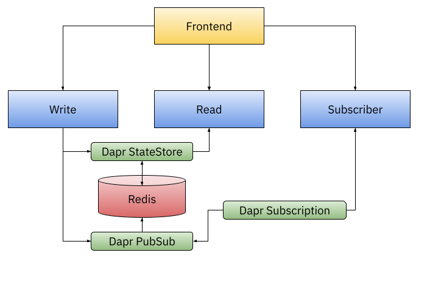
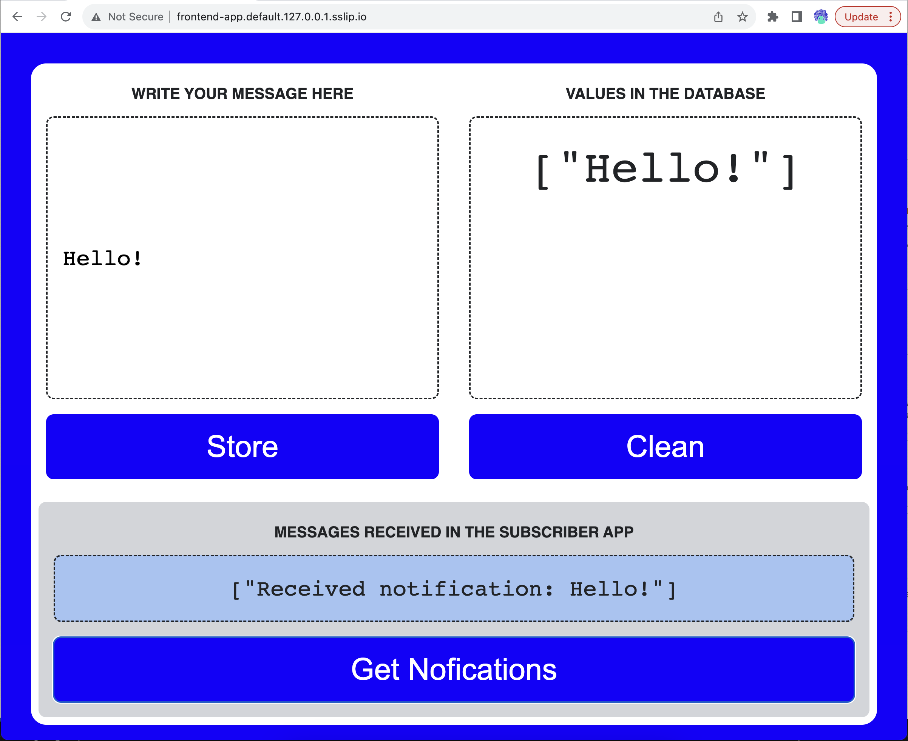

# WASM + Linux Containers + Dapr on Kubernetes
Example showing WASM and Linux Containers running side by side using Dapr APIs

On this example we will create a KinD cluster, we will install Knative Serving, Istio and Dapr, along side with RUNWASI and a simple distributed application including WASM applications interacting with Linux Containers. 


First create a KinD Cluster: 

```
cat <<EOF | kind create cluster --name dev --config=-
kind: Cluster
apiVersion: kind.x-k8s.io/v1alpha4
nodes:
- role: control-plane
  extraPortMappings:
  - containerPort: 31080 # expose port 31380 of the node to port 80 on the host, later to be use by kourier or contour ingress
    listenAddress: 127.0.0.1
    hostPort: 80
EOF
```

Then install tools and the sample app:

```
./install.sh
```

The install scripts installs Istio, Knative Serving and Dapr. Then it install Redis using a Helm Chart and a sample application composed by 3 backend services and one frontend. 



Once all the Pods are up and ready you can access the application by pointing your browser to [http://frontend-app.default.127.0.0.1.sslip.io](http://frontend-app.default.127.0.0.1.sslip.io)

You should see this app: 




